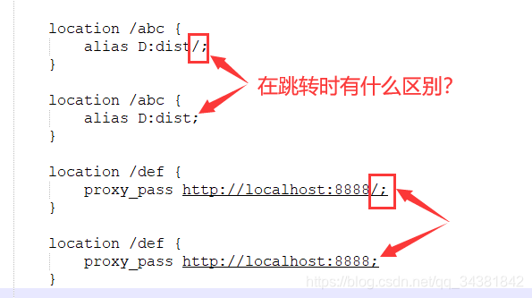
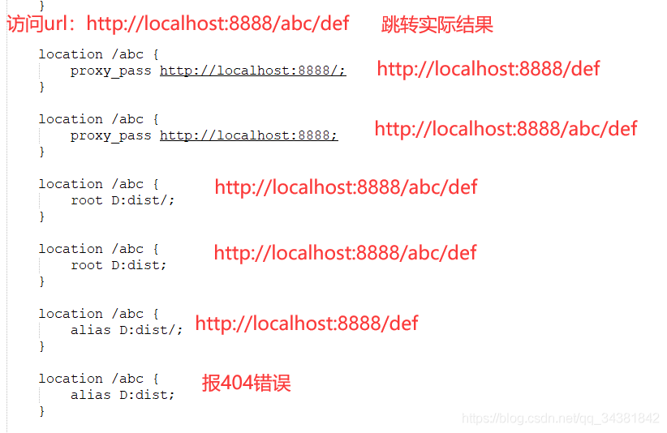

## 对于`location`末尾的`/`的处理

在配置nginx的nginx.conf文件中，会存在`location`配置项，一般我们会在大括号`{}`中配置的参数有：`proxy_pass`、`root`、`alias`。
这里有一个问题：这些参数的属性值末尾处加不加斜杠`/`，在nginx跳转时不会拼接上`location`里的路径？如图：

问：加`/`和不加`/`时，跳转会不会拼接上`location`里的路径？

参数项 | 加"/" |	不加"/"
--- | --- | ---
proxy_pass |	不会|	会
root |	会 |	会
alias |	不会 |	会报错

例子：

ref: <https://blog.csdn.net/qq_34381842/article/details/118898760>