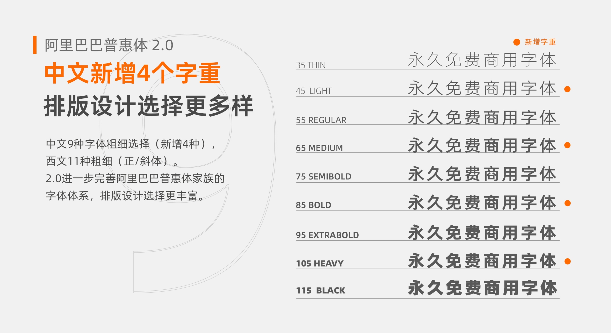

**本页目录**

[TOC]

## Web内嵌字体

1. 通过[字体裁剪](https://font-subset.disidu.com/)导出字形文件
2. 生成以下CSS样式

    ```css
    @font-face {
    font-family: "myFont";
    src: url("font-cliped.woff2") format("woff2"),
        url("font-cliped.woff") format("woff"),
        url("font-cliped.ttf") format("truetype"),
        url("font-cliped.eot") format("embedded-opentype"),
        url("font-cliped.svg") format("svg");
    }
    ```
    
    不考虑兼容性，src使用其中一种就好。`font-family` 指定定义引用的字体名称。

3. 在HTML中应用字体

    ```html
    <p style="font-family: myFont">我有别具一格的字体。</p>
    ```

其他字体剪裁工具[参考](https://ryuurock.github.io/2021/12/27/web-load-performance-optimization/)。


## 免费商用字体

- [免费字体下载_免费商用字体_免费字体网_自由字体官网](https://ziyouziti.com/)


## 我的字体库

随着大家对数字版权的重视，请谨慎使用来源不明的素材，如图片、字体、内容等，以免引起不必要的麻烦。

这里收录几款免费字体，可商用，==注意==：免费不等于无需授权[^no-auth]。

[^no-auth]:  不需要向权利人索取授权。有的字体权利人要求即使免费，但是依旧需要获得授权。


###  刻石录颜体

免费使用[^free-use]/无需授权[^no-auth]


下载：<https://ziyouziti.com/mianfeiziti-115.html>


### 思源系列

开源字体[^open-source]/无需授权[^no-auth]


- **宋体下载**：<https://github.com/adobe-fonts/source-han-serif/blob/master/README-CN.md>


- **黑体下载**： <https://github.com/adobe-fonts/source-han-sans/blob/master/README-CN.md>


### 阿里妈妈东方大楷

免费使用[^free-use]/无需授权[^no-auth]


- 官网：<https://www.iconfont.cn/fonts/detail?cnid=IhcTcFymWeyf>
- 备用下载：<https://font.chinaz.com/so/dongfangdakai.html>


### 阿里巴巴普惠体

免费使用[^free-use]/无需授权[^no-auth]



- 官网：<https://www.iconfont.cn/fonts/detail?cnid=adI1E7HF7yme>
- 备用下载：<https://font.chinaz.com/so/alibabapuhuiti.html>


### 霞鹜文楷 / LXGW WenKai

开源字体[^open-source]/无需授权[^no-auth]


- **官网介绍**：<https://lxgw.github.io/2021/01/28/Klee-Simpchin/>  
- **开源地址**：<https://github.com/lxgw/LxgwWenKai>  
- **下载地址**：<https://github.com/lxgw/LxgwWenKai/releases>


### 云峰寒蝉体

免费使用[^free-use]/无需授权[^no-auth]


- **官网介绍**：<https://mp.weixin.qq.com/s/qLRQPJf43h15yPgpcNbLNw>
- 备用下载：<https://font.chinaz.com/23082137138.htm>


### 西文字体

风格多样，自行选择吧。

- [Font Library](https://fontlibrary.org/)
- [Browse Fonts - Google Fonts](https://fonts.google.com/)
- [The League of Moveable Type – the first open-source font foundry](https://www.theleagueofmoveabletype.com/)


## Ref

- [站长字体_font.chinaz.com](https://font.chinaz.com)
- [免费可商用字体，有明确的授权出处，持续更新](https://github.com/wordshub/free-font)
- [免费字体获取和使用指南 - 少数派](https://sspai.com/post/42889)
- [Open-source Unicode typefaces - Wikipedia](https://en.wikipedia.org/wiki/Open-source_Unicode_typefaces)
- [fonts · GitHub Topics](https://github.com/topics/fonts)

---

[^open-source]: 开源字体，可以正常免费使用，含商业免费使用。

[^free-use]: 免费使用，含免费商业用途。