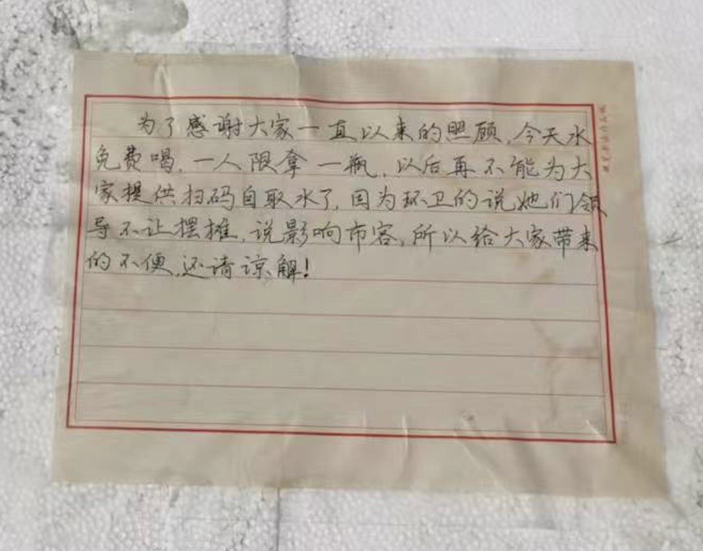
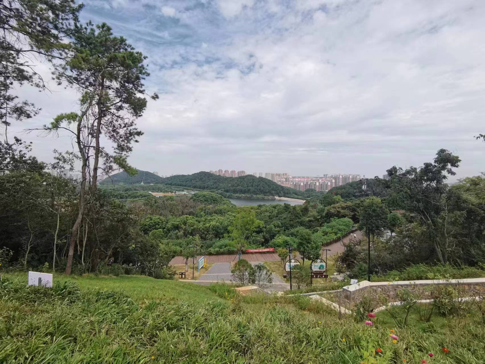
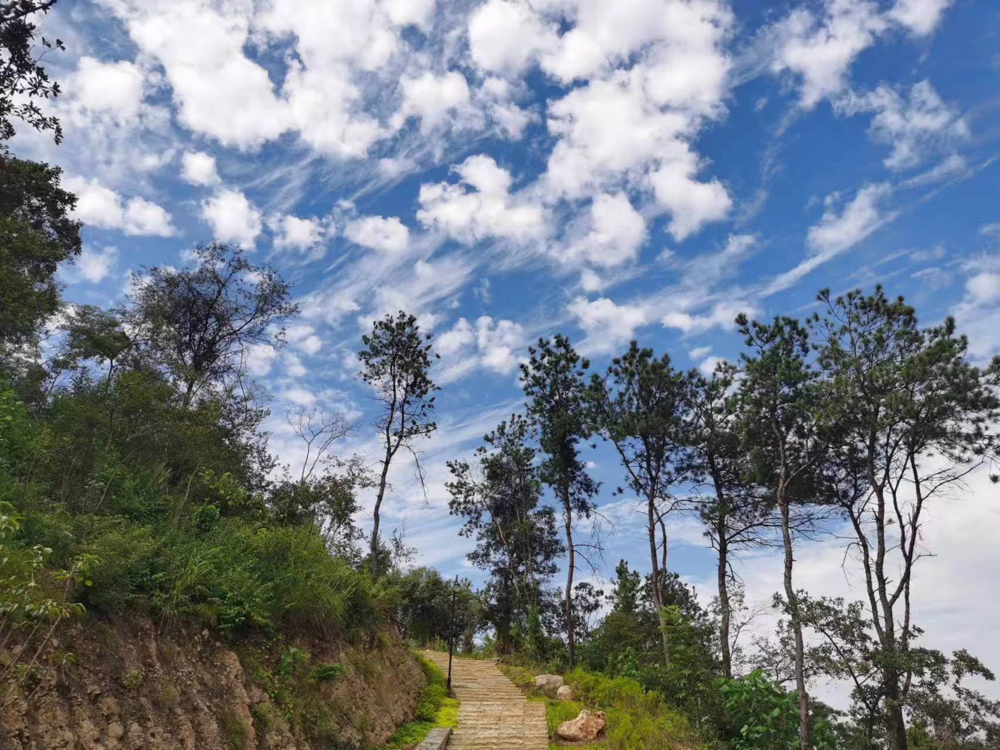

久违的蓝天白云出来了，恰逢周末，又没那么烈的阳光，正好全家出去采采气。离家不远处的大花山，人少，高度适中，很适合2~3小时放松。

驱车一刻钟的功夫便到了。可能是太阳公公也发现今天的秋色怡人，所以出来凑凑热闹。下车后暴露在太阳下，难免有种被炙烤的感觉，但强度比夏日略差，毕竟已是秋天。

踏着树荫，呼吸着山间的自由空气，不一会儿就到达半山腰。来时想着就这么两个小时，用不着带水，看来是低估了这天气，幸好山上有水，这不就是雪中送炭吗？当看到禁售告示时，心里不免有些失落、悲凉。

因为山上硬件设施一般，风景也谈不上有多别具一格，加上宣传力度弱，因此来游玩的人较少，人少就意味着商业化欠缺，所以还没有常见的便利店，有的人就用一个箱子，放上些纯净水，再放个二维码，算是一个简易的无人值守卖u水处，交易全凭自觉，如果不考虑一些其他别有用心，这种方式还是挺好的，毕竟解决了行人的一些必需，而劳动者也得到应有的回报，两全其美。而今天看到停止售卖，虽说意料之中，但难免有些不悦，后续肯定商业化，价格肯定不会实惠，毕竟能进入到这里，背后的付出应该能猜得到。不知道啥时候起，为人民服务变成了为人民服务的枷锁，这种制度就变味了，奧，不是制度变味了，而是背后的人变味了。

你测 枯

hello world

盯原
冬巴啦·
基本上可以的。ds

world
nice 可谓fdffff

 girls 可以d
要

无论何时，美景不可辜负！

顶起要顶起枯顶戴枯

<https://baidu.com>

