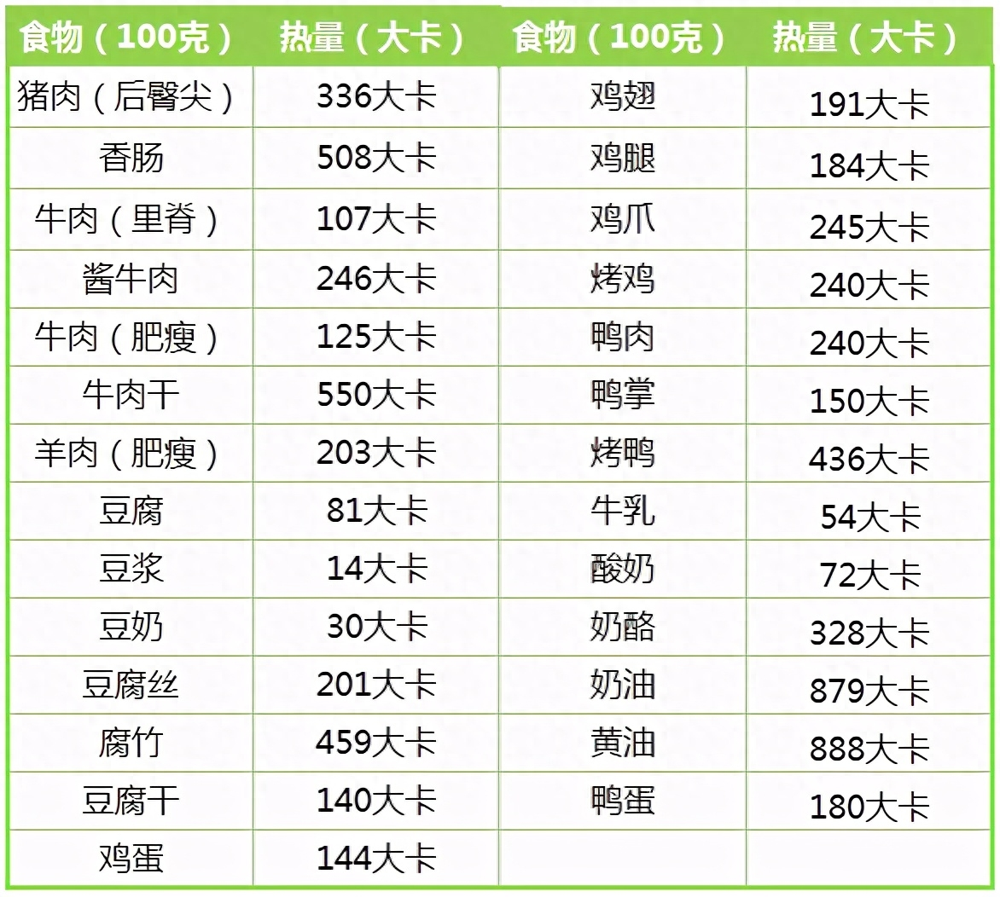
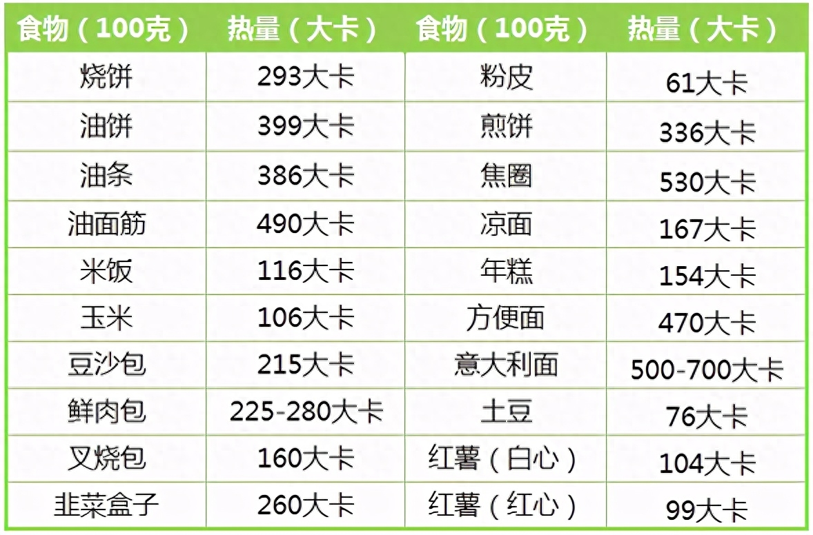
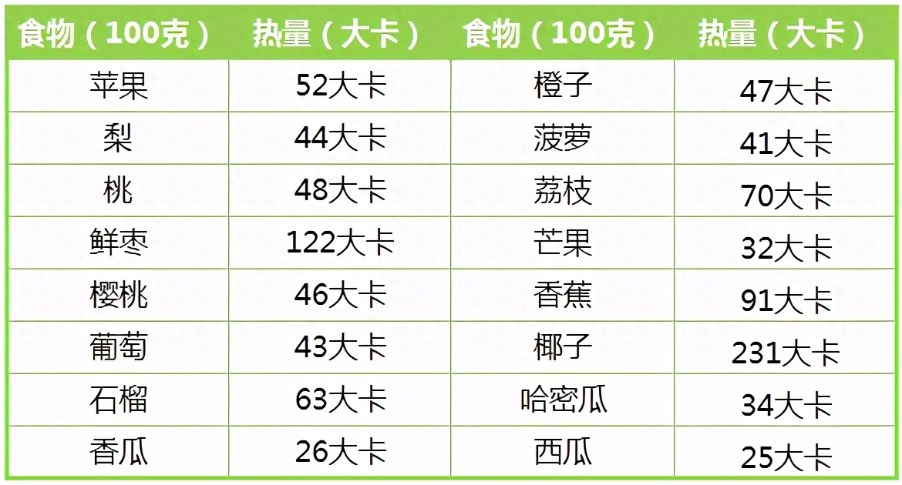

自古就有民以食为天的说法，因为饮食对我们来说太重要不过了。最早的饮食为得是解决裹腹的生理需求，而随着物质生活的极大丰富，饮食结构发生变化，现在人的饮食大都会造成过量摄入，反而对身体造成较大的负担，危害我们的身体健康。

今天主要聊的话题是，注重饮食健康，让生活更美好。

## 科普

根据世界卫生组织出版的《热量和蛋白质摄取量》一书，一个健康的成年女性每天需要摄取1800-1900卡路里的热量，男性则需要1980-2340卡路里的热量。 其中，蛋白质摄取量应为人体每日所需热量的10%-15%；碳水化合物摄取量应不少于人体每日所需热量的55%；脂肪的摄取量应不超过每日所需热量的30%。

如何知道食物的成分呢

下载几个 APP，比如“食物库”、“卡卡健康”、“myfitnesspal”都是计算热量的。自己所吃的食物录入进去，慢慢就可以记住常吃食物的信息。另附常见食物热量表。

常见食物热量表1

常见食物热量表2

常见食物热量表3

三大营养

蛋白质

蛋白质对减肥的重要性无可取代。 它负责修复并合成肌肉组织，进而提升基础代谢率，加快热量消耗。蛋白质本身超高的食物热效应也能提升近30%基础代谢率，并且维持时间长达10到12个小时。

碳水化合物

碳水化合物是支撑人体生理活动的最直接的能量来源，它同时具备无氧氧化和有氧氧化的特点，这意味着碳水化合物既能给无氧运动供能，也能给有氧运动提供能量。无论是增肌还是减脂，都离不开碳水化合物。

脂肪

脂肪并非全都是有害健康的。人体中一些必要的脂溶性维生素必须通过脂肪才能被良好地吸收转化。不饱和脂肪酸更能降低血管中的胆固醇含量，对心血管系统起到保护作用。

分解顺序

虽然同为三大营养素，都可以为身体提供能量，但是它们被分解的优先程度是不同的，顺序是：碳水化合物＞蛋白质＞脂肪。过多的摄入会转化为脂肪沉淀，为什么要增肥容易，减肥难，就是因为脂肪是个『老顽固』，普通简单的运动都消耗不掉它。

摄入量

蛋白质： 成年男性每天建议摄入66克，成年女性每天建议摄入55克。植物蛋白和动物蛋白可各占一半。

碳水化合物： 占一天摄入总热量的30%-40%左右，优先选择低升糖指数的碳水化合物，避免血糖上升过快刺激胰岛素分泌，加速脂肪合成。

脂肪： 控制在一天摄入总热量的20%-25%，远离反式脂肪，控制饱和脂肪的摄入，合理补充不饱和脂肪酸。

简单有个了解就好，真要到每天精确的份量配比摄入，估计没多少人坚持下来。

三大营养素的优质来源
蛋白质： 少食用深色肉类（猪牛羊肉）和动物内脏，尽量选择无色和浅色的肉类，奶制品以及大豆类食物。典型食物有鸡蛋、去皮鸡胸肉、鳕鱼、龙利鱼、黄豆等。

碳水化合物： 尽量选择低升糖指数、富含膳食纤维的碳水化合物。典型水果类食物有苹果、梨、桃子；粗粮类有燕麦、荞麦、紫薯。

脂肪： 多吃鱼类、虾类、鸡肉，少吃猪肉、牛肉和羊肉。食用油选择橄榄油、葵花籽油等植物油。烹饪上尽量避免油炸，多用凉拌、清蒸、煮等。

那一般要怎么吃呢？目前主要还是两大摄入途径，正餐与零食。

正餐

老祖宗给我们留下来的经验是，一天三顿饭，只吃八分饱，直到现在依旧适用。

三顿饭，可以按照中华营养协会提供的『中国居民平衡膳食宝塔』中推荐的食物轮换搭配即可。

中国居民平衡膳食宝塔

八分饱，每次吃饭时，当感觉不到饿时，就可以停下来。等你觉得自己吃饱时，实际已经过量了。

零食

上面推荐的食物中，像水果，坚果可以作为日常正餐间的零食补充。需要注意控制量，一般用一只手拿下的量就可以了。如果非要想喝个奶茶，偶尔一次也不是不行。

轻断食

如果还想有点儿什么新花样的话，可以尝试下轻断食。每周挑选一天，那天仅吃一顿饭，再变为仅吃一次代餐食品，直到最后全天不吃。有什么好处呢？具体里面的科学依据还有不同的说法，感兴趣的话，可以网上搜索下看看。对我个人而言，一来可以让身体锻炼下，增强各器官在饥饿状态下的应对能力，另一个就是可以体验下饥饿的感觉（不知道在你看来是不是自虐倾向~），好处自己根据实际情况想想就好。

以上提到的方式方式仅适合正常的普通人群大众，有相关疾病的人员，还是需要遵循医嘱。健康生活就从这里开始。

这里是毓知精选，如果您有好的关于工作与生活的资料，欢迎私信推荐给我们，与大家一起分享，共同向着美好的未来砥砺前行，希望有您的陪伴，谢谢！