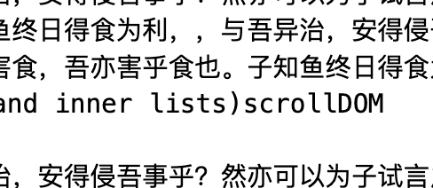
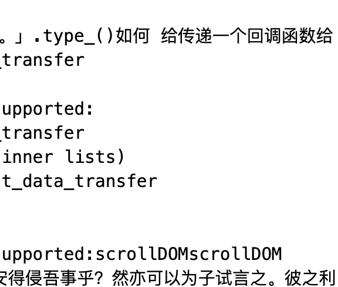
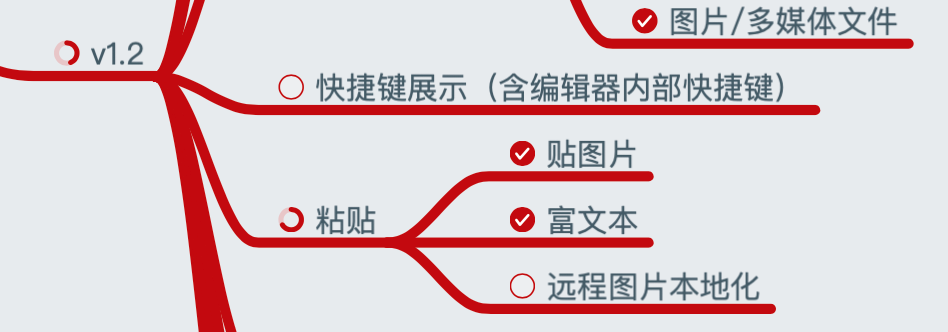

与吾异治，安得侵吾事乎


Examples
Get the type of a buffer


replaceSelection

```javascript
replaceSelection
```


[[渔樵问对的副本2.md]]

然亦可以为子试言之。彼之利，**犹此之**利也；**亦犹此之害**也。子知其小，未知其大。鱼之利食，吾亦利乎食也；鱼之害食，吾亦害乎食也。子知鱼终日得食为利，，**与吾EMdEdit**orCmdsEMdEditorCmds吾事乎？然亦可以为子试言之。彼之利，犹此之利也；彼之害，亦犹此之害也。子知其小，未知其大。鱼之利食，吾亦利乎食也；鱼之害食，吾亦害乎食也。子知鱼终日得然亦可以为子试言之。彼之利，犹此之利也；彼之害，亦犹此之害也。子知其小，未知其大。鱼之利食，吾亦利乎食也；鱼之害食，吾亦害乎食也。子知鱼终日得食为利，与吾异治，安得侵吾事乎？然亦可以为子试言之。彼之利，犹此之利也；彼之害，亦犹此之害也。子知其小，未知其大。鱼之利食，吾亦利乎食也；鱼之害食，吾亦害乎食也。子知鱼终日得


1 	《渔樵对问》

  

  

2 	康节先生 邵雍 尧夫s

3 	渔者垂钓于伊水之上。樵者过之，弛担息肩，坐于磐石之上，而问于渔者。

4 	曰：「鱼可钩取乎？」


5 	曰：「然。」.type_()如何 给传递一个回调函数给 RUST WASM注微信




JavaScript 原生深度复制：使用 JSON.parse(JSON.stringify(obj)) 来深度复制对象。这在 Rust 的 web-sys 里可以通过 js_sys 模块实现。例如：
sds
use js_sys::{JSON, Object};

let original_data = /* 获取你的数据 */;
let json_str = JSON::stringify(&original_data).unwrap();
let cloned_data = JSON::parse(&json_str).unwrap();
手动复制：对于复杂的数据结构，你可能需要手动遍历并复制每个字段。例如，对于数组或对象，你可以递归地复制每个元素或属性。

Rust 数据结构：如果你将 Web 数据转换为 Rust 的数据结构（如 Vec 或 HashMap），你可以利用 Rust 的 Clone trait 来深度复制。例如：

let original_vec = /* 原始 Vec */;
let cloned_vec = original_vec.clone(); // 这里会进行深度复制
选择合适的方法取决于你的数据类型和应用场景。1.  **JavaScript 原生深度复制**：使用 `JSON.parse(JSON.stringify(obj))` 来深度复制对象。这在 Rust 的 `web-sys` 里可以通过 `js_sys` 模块实现。例如：    
    

    
但从新锦江大酒店顶层望出去的窗景，在过去30多年里因为一个人，一次次被历史定格，透视着这座东方大城的生长。

[[blog/2021/托付终身的产品.md]]

1

1978年，改革开放的浪潮奔涌而来。但从新锦江大酒店顶层望出去的窗景，在过去30多年里因为一个人，一次次被历史定格，透视着这座东方大城的生长。


**1**

1978年，改革开放的浪潮奔涌而来。    
    
    
2.  **手动复制**：对于复杂的数据结构，你可能需要手动遍历并复制每个字段。例如，对于数组或对象，你可以递归地复制每个元素或属性。
    
3.  **Rust 数据结构**：如果你将 Web 数据转换为 Rust 的数据结构（如 `Vec` 或 `HashMap`），你可以利用 Rust 的 `Clone` trait 来深度复制。例如：    
    
    `let original_vec = /* 原始 Vec */;
    let cloned_vec = original_vec.clone(); // 这里会进行深度复制`
    




[[blog/2024/algolia.md]]

    

选择合适的方法取决于你的数据类型和应用场景。

然亦可以为子试言之。彼之利，犹此之利也；彼之害，亦犹此之害也。子知其小，未知其大。鱼之利食，吾亦利乎食也；鱼之害食，吾亦害乎食也。子知鱼终日得食为利，，与吾异治，安得侵吾事乎？然亦可以为子试言之。彼之利，犹此之利也；彼之害，亦犹此之害也。子知其小，未知其大。鱼之利食，吾亦利乎食也；鱼之害食，吾亦害乎食也。子知鱼终日得食为利，，与吾异治，安得侵吾事乎？

Features
Currently supported:scrollDOMscrollDOM
，与吾异治，安得侵吾事乎？然亦可以为子试言之。彼之利，犹此之利也；彼之害，亦犹此之害也。子知其小，未知其大。鱼之利食，吾亦利乎食也；鱼之害食，吾亦害乎食也。子知鱼终日得食为利，，与吾异治，安得侵吾事乎？然亦可以为子试言之。彼之利，犹此之利也；彼之害，亦犹此之害也。子知其小，未知其大。鱼之利食，吾亦利乎食也；鱼之害食，吾亦害乎食也。子知鱼终日得食为利，print_data_transfer
Lists (and inner lists)scrollDOM
Headers
，与吾异治，安得侵吾事乎？然亦可以为子试言之。彼之利，犹此之利也；彼之害，亦犹此之害也。子知其小，未知其大。鱼之利食，吾亦利乎食也；鱼之害食，吾亦害乎食也。子知鱼终日得食为利，
6 	曰：「钩非饵可乎」
DataTransferItem
7 	曰：「否。」
8 	曰：「非钩也，饵也。鱼利食而见害，人利鱼而蒙利，其利同也，其害异也。敢问何故」
.scrollDOM.scrollDOM
，与吾异治，安得侵吾事乎？然亦可以为子试言之。彼之利，犹此之利也；彼之害，亦犹此之害也。子知其小，未知其大。鱼之利食，吾亦利乎食也；鱼之害食，吾亦害乎食也。子知鱼终日得食为利，
9 	渔者曰：「子樵者也，与吾异治，安得侵吾事乎？然亦可以为子试言之。彼之利，犹此之利也；彼之害，亦犹此之害也。子知其小，未知其大。鱼之利食，吾亦利乎食也；鱼之害食，吾亦害乎食也。子知鱼终日得食为利，又安知鱼终日不得食为害？如是，则食之害也重，而钩之害也轻。子知吾终日得鱼为利，又安知吾终日不得鱼不为害也？如是，则吾之害也重，鱼之害也轻。以鱼之一身，当人之食，是鱼之害多矣；以人之一身，当鱼之一食，则人之害亦多矣。又安知钓乎大江大海，则无易地之患焉？鱼利乎水，人利乎陆，水与陆异，其利一也；鱼害乎饵，人害乎财，饵与财异，其害一也。又何必分乎彼此哉！子之言，体也，独不知用尔。

10 	樵者又问曰：「鱼可生食乎？」也，与吾异治，安得侵吾事乎？然亦可以为子试言之。彼之利，犹此之利也；彼之害，亦犹此之害也。子知其小，未知其大。鱼之利食，吾亦利乎食也；鱼之害食，吾亦害乎食也。子知鱼终日得食为利，又安知鱼终日不得食为害？如是，则食之害也重，而钩之害也轻。子知吾终日得鱼为利，又安知吾终日不得鱼不为害也？如是，则吾之害也重，鱼之害也轻。以鱼之一身，当

11 	曰：「烹之可也。」

12 	曰：「必吾薪济子之鱼乎」

13 	曰：「然。「html_to_markdown v0.1.0 
Convert HTML to Markdown
hecksum
14 	曰：「吾知有用乎子矣。」

15 	曰：「然则子知子之薪，能济吾之鱼，不知子之薪所以能济吾之鱼也。薪之能济鱼久矣，不待子而后知。苟世未知火之能用薪，则子之薪虽积丘山，独且奈何哉？」

16 	樵者曰：「愿闻其方。」

17 	曰：「火生于动，水生于静。动静之相生，水火之相息。水火，用也；草木，体也。用生于利，体生于害。利害见乎情，体用隐乎性。一性一情，圣人能成子之薪。犹吾之鱼，微火则皆为腐臭败坏，而无所用矣，又安能养人七尺之躯哉？」

18 	樵者曰：「火之功大于薪，固已知之矣。敢问善灼物，何必待薪而后传。」

19 	曰：「薪，火之体也。火，薪之用也。火无体，待薪然后为体；薪无用，待火然后为用。是故凡有体之物，皆可焚之矣。」

20 	曰：「水有体乎？」

21 	曰：「然。」

22 	曰：「火能焚水乎「

23 	曰：「火之性，能迎而不能随，故灭。水之体，能随而不能迎，故热，是故有温泉而无寒火，相息之谓也。」

24 	曰：「火之道生于用，亦有体乎？」

25 	曰：「火以用为本，以体为末，故动。水以体为本，以用为末，故静。是火亦有体，水亦有用也。故能相济又能相息，非独水火则然，天下之事皆然。在乎用之何如尔。」

26 	樵者曰：「用可得闻乎？」

27 	曰：「可以意得者，物之性也。可以言传者，物之情也。可以象求者，物之形也。可以数取者，物之体也。用也者，妙万物为言者也，可以意得，而不可以言传。」

28 	曰：「不可以言传，则子恶得而知之乎？」

29 	曰：「吾所以得而知之者，固不能言传，非独吾不能传之以言，圣人亦不能传之以言也。」

30 	曰：「圣人既不能传之以言，则六经非言也耶？」

31 	曰：「时然后言，何言之有？」

32 	樵者赞曰：「天地之道备于人，万物之道备于身，众妙之道备于神，天下之能事毕矣，又何思何虑！吾而今而后，知事心践形之为大。不及子之门，则几至于殆矣。」

33 	乃析薪烹鱼而食之饫，而论《易》。

34 	渔者与樵者游于伊水之上。渔者叹曰：「熙熙乎万物之多，而未始有杂。吾知游乎天地之间，万物皆可以无心而致之矣。非子则孰与归焉？」

35 	樵者曰：「敢问无心致天地万物之方。」

36 	渔者曰：「无心者，无意之谓也。无意之意，不我物也。不我物，然后定能物物。」

37 	曰：「何谓我，何谓物？」

38 	曰：『以我徇物，则我亦物也；以物徇我，则物亦我也。我物皆致，意由是明。天地亦万物也，何天地之有焉？万物亦天地也，何万物之有焉？万物亦我也，何万物之有焉？我亦万物也，何我之有焉？何物不我？何我不物？如是则可以宰天地，可以司鬼神。而况于人乎？况于物乎？「

39 	樵者问渔者曰：「天何依？」

40 	曰：「依乎地。」

41 	曰：「地何附？」

42 	曰：「附乎天。」

43 	曰：「然则天地何依何附？」

44 	曰：「自相依附。天依形，地附气。其形也有涯，其气也无涯。有无之相生，形气之相息。终则有始，终始之间，其天地之所存乎？天以用为本，以体为末；地以体为本，以用为末。利用出人之谓神，名体有无之谓圣。唯神与圣，能参乎天地者也。小人则日用而不知，故有害生实丧之患也。夫名也者，实之客也；利也者，害之主也。名生于不足，得丧于有馀。害生于有馀，实丧于不足。此理之常也。养身者必以利，贪夫则以身殉得，故有害生焉。立身必以名，众人则以身殉名，故有实丧焉。窃人之财谓之盗，其始取之也，唯恐其不多也，及其败露也，唯恐其多矣。夫贿之与赃，一物而两名者，利与害故也。窃人之美谓之徼，其始取之也，唯恐其不多也。及其败露，唯恐其多矣。夫誉与毁，一事而两名者，名与实故也。凡言朝者，萃名之地也；市者，聚利之地也。能不以争处乎其间，虽一日九迁，一货十倍，何害生实丧之有耶？是知争也者取利之端也；让也者趋名之本也。利至则害生，名兴则实丧。利至名兴，而无害生实丧之患，唯有德者能之。天依地，地会天，岂相远哉！

45 	渔者谓樵者曰：「天下将治，则人必尚行也；天下将乱，则人必尚言也。尚行，则笃实之风行焉；尚言，则诡谲之风行焉。天下将治，则人必尚义也；天下将乱，则人必尚利也。尚义，则廉让之风行焉；尚利，则攘夺之风行焉。三王，尚行者也；五霸，尚言者也。尚行者必入于义也，尚言者必入于利也。义利之相去，一何如是之远耶？是知言之于口，不若行之于身，行之乾身，不若尽之于心。言之于口，人得而闻之，行之于身，人得而见之，尽之干心，神得而知之。人之聪明犹不可欺，况神之聪明乎？是知无愧于口，不若无愧于身，无愧于身，不若无愧于心。无口过易，无身过难，无身过易，无心过难。既无心过，何难之有！吁，安得无心过之人，与之语心哉！」

46 	渔者谓樵者曰：「子知观天地万物之道乎？」

47 	樵者曰：「未也。愿闻其方。」

48 	渔者曰：「夫所以谓之观物者，非以目观之也，非观之以目，而观之以心也；非观之以心，而观之以理也。天下之物，莫不有理焉，莫不有性焉，莫不有命焉。所以谓之理者，穷之而后可知也；所以谓之性者，尽之而后可知也；所似谓之命者，至之而后可知也。此三知也，天下之真知也，虽圣人无以过之也。而过之者，非所以谓之圣人也。夫鉴之所以能为明者，谓其能不隐万物之形也。虽然鉴之，能不隐万物之形，未若水之能一万物之形也。虽然水之能一万物之形，又未若圣人之能一万物情也。圣人之所以我一万物之情者，谓其圣人之能反观也。所以谓之反观者，不以我观物也。不以我观物者，以物观物之谓也。又安有我于其间哉？是知我亦人也，人亦我也。我与人皆物也。此所以能用天下之目为己之目，其目无所不观矣。用天下之耳为己之耳，其耳无所不听矣。用天下之口为己之口，其口无所不言矣。用天下之心为己之心，其心无所不某矣。天下之观，其于见也，不亦广乎！天下之听，其于闻也，不亦远乎！天下之言，其于论也，不亦高乎？天下之谋，其于乐也，不亦大乎！夫其见至广，其闻至远，其论至高，其乐至大，能为至广、至远、至高、至大之事，而中无一为焉，岂不谓至神至圣者乎？非唯一时之天下谓之至神奎圣者乎，而千万世之天下谓之至神至圣者乎？非唯一时之天下渭之至神至圣者乎，而千万世之天下谓之至神圣者乎？过此以往，未之或知也已。」

49 	樵者问渔者曰：「子以何道而得鱼？」

50 	曰：「吾以六物具而得鱼。」

51 	曰：「六物具也，岂由天乎？」

52 	曰：「具六物而得鱼者，人也。具六物而所以得鱼者，非人也。」

53 	樵者未达，请问其方。

54 	渔者曰：「六物者，竿也，纶也，浮也，沉也，钩也，饵也。一不具，则鱼不可得。然而六物具而不得鱼者，非人也。六物具而不得鱼者有焉，未有六物不具而得鱼者也。是知具六物者，人也。得鱼与不得鱼，天也。六物不具而不得鱼者，非天也，人也。」

55 	樵者曰：「人有祷鬼神而求福者，福可祷而求耶？求之而可得耶？敢问其所以。」

56 	曰：「语善恶者，人也；福祸者，天也。天道福善而祸淫，鬼神岂能违天乎自作之咎，固难逃已；天之灾，禳之奚益修德积善，君子常分。安有馀事于其间哉！」

57 	樵者曰：「有为善而遇祸，有为福而获福者，何也？」

58 	渔者曰：「有幸与不幸也。幸不幸，命也；当不当，分也。一命一分，人其逃乎？」

59 	曰：「何谓分？何谓命？」

60 	曰：「小人之遇福，非分也，有命也；当祸，分也，非命也。君子之遇祸，非分也，有命也；当福，分也，非命也。」

61 	渔者谓樵者曰：「人之所谓亲，莫如父子也；人之所渭疏，莫如路人也。利言在心，则父子过路人远矣。父子之道，天生也。利害犹或夺之，况非天必者乎夫利害之移人，如是之深也，可不慎乎？路人之相逢则过之，固无相害之心焉，无利害在前故也。有利害在前，则路人与父子，又奚择焉？路人之能相交以义，又何况父子之亲乎！夫义者，让之本也；利者，争之端也。让则有仁，争则有害，仁与害，何相去之远也！尧、舜亦人也。桀、纣亦人也，人与人同而仁与害尔，仁因义而起，害因利而生。利不以义，则臣弑其君者有焉，子弑其父者有焉。岂若路人之相逢，一目而交袂于中逵者哉！」

62 	樵者谓渔者曰：「吾尝负薪矣，举百斤而无伤吾之身，加十斤则遂伤吾之身，敢问何故？」

63 	渔者曰：「樵则吾不知之矣。以吾之事观之，则易地皆然。吾尝钓而得大鱼，与吾交战。欲弃之，则不能舍，欲取之，则未能胜。终日而后获，几有没溺之患矣。非直有身伤之患耶？鱼与薪则二也，其贪而为伤则一也。百斤，力分之内者也，十斤，力分之外者也。力分之外，虽一毫犹且为害，而况十斤乎！吾之贪鱼亦何以异子之贪薪乎！」


[[_page/home.md]]
64 	樵者叹曰：「吾而今而后，知量力而动者智矣哉！」

65 	樵者谓渔者曰：「子可谓知《易》之道矣。吾也问：《易》有太极，太极何物也？」

66 	曰：「无为之本也。」

67 	曰：「太极生两仪，两仪，天地之谓乎」

68 	曰：「两仪，天地之祖也，非止为天地而已也。太极分而为二，先得一为一，后得一为二。一二谓两仪。」

69 	曰：「两仪生四象，四象何物也？」

70 	曰：「四象谓阴阳刚柔。有阴阳然后可以生天，有刚柔然后可以生地。立功之本，于斯为极。」

71 	曰：「四象生八卦，八卦何谓也？」

72 	曰：「谓乾、坤、离、坎、兑、良、震、巽之谓也。迭相盛衰终始于其间矣。因而重之，则六十四卦由是而生也，而《易》之道始备矣。」

73 	樵者问渔者曰：「复何以见天地之心乎？」

74 	曰：「先阳已尽，后阳始生，则天地始生之际。中则当日月始周之际，末则当星辰始终之际。万物死生，寒暑代谢，昼夜变迁，非此无以见之。当天地穷极之所必变，变则通，通则久，故《象》言『先王以至日闭关，商旅不行，后不省方。」，顺天故也。」

75 	樵者谓渔者曰：「无妄，灾也。敢问何故？」

76 	曰：「则欺他，得之必有祸，斯有妄也。顺天而动，有祸及者，非祸也，灾也。犹农有思丰而不勤稼稿者，其荒也，不亦祸乎？农有勤稼穑而复败诸水旱者，其荒也，不亦灾乎？故《象》言『先

77 	王以茂对时育万物』，贵不妄也。」

78 	樵者问曰：「姤，何也」

79 	曰：「姤，遇也。柔遇刚也，与夬正反。夬始逼壮，姤始遇壮，阴始遇阳，故称姤焉。观其姤，天地之心，亦可见矣。圣人以德化及此，网有不昌。故《象》言『后以施命诰四方』，履霜之慎，其在此也。」

80 	渔者谓樵者曰：「春为阳始，夏为阳极，秋为阴始，冬为阴极。阳则温，阳极则热；阴始则凉，阴极则寒。温则生物，热则长物，凉则收物，寒则杀物。皆一气别而为四焉。其生万物也亦然。」

81 	樵者问渔者曰：「人之所以能灵于万物者，何以知其然耶」

82 	渔者对曰：「谓其目能收万物之色，耳能收万物之声，鼻能收万物之气，口能收万物之味。声色气味者，万物之体也。目耳口鼻者，万人之用也。体无定用，惟变是用。用无定体，惟化是体。体用交而人物之道于是乎备矣。然则天亦物也，圣亦人也。有一物之物，有十物之物，有百物之物，有千物之物，有万物之物，有亿物之物，有兆物之物。为兆物之物，岂非人乎！有一人之人，有十人之人，有百人之人，有千人之人，有万人之人，有亿人之人，有兆人之人。为兆人之人，岂非圣乎！是知人也者，物之至者也。圣也者，人之至者也。物之至者始得谓之物之物也。人之至者始得谓之人之人也。夫物之物者，至物之谓也。人之人者，至人之谓也。以一至物而当一至人，则非圣人而何？人谓之不圣，则吾不信也。何哉？谓其能以一心观万心，一身观万身，一物观万物，一世观万世者焉。又谓其能以心代天意，口代天言，手代天功，身代天事者焉。又谓其能以上顺天时，下应地理，中徇物情，通尽人事者焉。又谓其能以弥纶天地，出入造化，进退今古，表里时事者焉。噫，圣人者，非世世而效圣焉。吾不得而目见之也。虽然吾不得而目见之，察其心，观其迹，探其体，潜其用，虽亿万千年亦可以理知之也。人或告我曰：『天地之外，别有天地万物，异乎此天地万物。』则吾不得而知之也。非唯吾不得而知之也，圣人亦不得而知之也。凡言知者，谓其心得而知之也。言言者，谓其口得而言之也。既心尚不得而知之，口又恶得而言之乎？以不可得知而知之，是谓妄知也。以不可得言而言之，是谓妄言也。吾又安能从妄人而行妄知妄言者乎！

83 	渔者谓樵者曰：「仲尼有言曰：殷因于夏礼，所捐益可知也；周因于殷礼所捐益可知也。其或继周者，虽百世可知也。夫如是，则何止于百世而已哉!亿千万世，皆可得而知之也。人皆知仲尼之为仲尼，不知仲尼之所以为仲尼，不欲知仲尼之所以为仲尼则已，如其必欲知仲尼之所以为仲尼，则舍天地将奚之焉人皆知天地之为天地，不知天地之所以为天地。不欲知天地之所以为天地则已，如其必欲知天地之所以为天地，则舍动静将奚之焉夫一动一静者，天地至妙者欤夫一动一静之间者，天地人至妙至妙者欤是知仲尼之所以能尽三才之道者，谓其行无辙迹也。故有言曰：『予欲无言』，又曰：『天何言哉!四时行焉，百物生焉。』其此之谓与」

84 	渔者谓樵者曰：「大哉!权之与变乎非圣人无以尽之。变然后知天地之消长，权然后知天下之轻重。消长，时也；轻重，事也。时有否泰，事有损益。圣人不知随时否泰之道，奚由知变之所为乎圣人不知随时损益之道，奚由知权之所为乎运消长者，变也；处轻重者，权也。是知权之与变，圣人之一道耳。」

85 	樵者问渔者曰：「人谓死而有知，有诸」

86 	曰：「有之。」

87 	曰：「何以知其然」

88 	曰：「以人知之。」

89 	曰：「何者谓之人」

90 	曰：「目耳鼻口心胆脾肾之气全，谓之人。心之灵曰神，胆之灵曰魄，脾之灵曰魂，肾之灵曰精。心之神发乎目，则谓之视；肾之精发乎耳，则谓之听；脾之魂发乎鼻，则谓之臭；胆之魄发乎口，则谓之言。八者具备，然后谓之人。夫人也者，天地万物之秀气也。然而亦有不中者，各求其类也。若全得人类，则谓之曰全人之人。夫全类者，天地万物之中气也，谓之日全德之人

91 	也。全德之人者，人之人者也。夫人之人者，仁人之谓也。唯全人，然后能当之。人之生也，谓其气行，人之死也，谓其形返。气行则神魂交，形返则精魄存。神行于天，精魄返于地。行于天，则渭之曰阳行；返于地，则谓之曰阴返。阳行则昼见而夜伏者也；阴返则夜见而昼伏者也。是故，知日者月之形也，月者日之影也。阳者阴之形也，阴者阳之影也。人者鬼之形也，鬼者人之影也。人谓鬼无形而无知者，吾不信也。」

92 	樵者问渔者曰：「小人可绝乎」

93 	曰：「不可。君子禀阳正气而生，小人禀阴邪气而生。无阴则阳不成，无小人则君子亦不成，唯以盛衰乎其间也。阳六分，则阴四分；阴六分，则阳四分。阳阴相半，则各五分矣。由是知君子小人之时有盛衰也。治世则君子六分。君子六分，则小人四分，小人固不能胜君子矣。乱世则反是，君君，臣臣，父父，子子，兄兄，弟弟，夫夫，妇妇，谓各安其分也。君不君，臣不臣，父不父，子不子，兄不兄，弟不弟，夫不夫，妇不妇，谓各失其分也。此则由世治世乱使之然也。君子常行胜言，小人常言胜行。故世治则笃实之士多，世乱则缘饰之士从。笃实鲜不成事，缘饰鲜不败事。成多国兴，败多国亡。家亦由是而兴亡也。夫兴家与兴国之人，与亡国亡家之人，相去一何远哉!」

94 	樵者问渔者曰：「人所谓才者，有利焉，有害焉者，何也」

95 	渔者曰：「才一也，利害二也。有才之正者，有才之不正者。才之正者，利乎人而及乎身者也；才之不正者，利乎身而害乎人者也。」

96 	曰：「不正，则安得谓之才」

97 	曰：「人所不能而能之，安得不谓之才圣人所以异乎才之难者，谓其能成天下之事而归之正者寡也。若不能归之以正，才则才矣，难乎语其仁也。譬犹药疗疾也，毒药亦有时而用也，可一而不可再也，疾愈则速已，不已则杀人矣。平药则常常日用之可也，重疾非所以能治也。能驱重疾而无害人之毒者，古今人所谓良药也。《易》曰：『大君有命，开国承家，小人勿用。』如是，则小人亦有时而用之。时平治定，用之则否。《诗》云：『它山之石，可以攻玉。』其小人之才乎!」

98 	樵者谓渔者曰：「国家之兴亡，与夫才之邪正，则固得闻命矣。然则何不择其人而用之」

99 	渔者曰：「择臣者，君也；择君者，臣也。贤愚各从其类而为。奈何有尧舜之君，必有尧舜之臣；有桀纣之君，而必有桀纣之臣。尧舜之臣，生乎桀纣之世，桀纣之臣，生于尧舜之世，必非其所用也。虽欲为祸为福，其能行乎夫上之所好，下必好之。其若影响，岂待驱率百然耶上好义，则下必好义，而不义者远矣；上好利，下必好利，而不利者远矣。好利者众，则天下日削矣；好义者众，则天下日盛矣。日盛则昌，日削则亡。盛之与削，昌之与亡，岂其远乎在上之所好耳。夫治世何尝无小人，乱世何尝无君子，不用则善恶何由而行也。」

100 	樵者曰：「善人常寡，而不善人常众;；治世常少，乱世常多，何以知其然耶」

101 	曰：「观之于物，何物不然譬诸五谷，耘之而不苗者有矣。蓬莠不耘而犹生，耘之而求其尽也，亦未如之何矣!由是知君子小人之道，有自来矣。君子见善则嘉之，见不善则远之；小人见善则疾之，见不善则嘉之。善恶各人其类也。君子见善则就之，见不善则违之；小人见善则违之，见不善则就之。君子见义则迁，见利则止；小人见义则止，见利则迁。迁义则利人，迁利则害人。利人与害人，相去一何远耶家与国一也，其兴也，君子常多而小人常鲜；其亡也小人常多而君子常鲜。君子多而去之者，小人也；小人多而去之者，君子也。君子好生，小人好杀。好生则世治，好杀则世乱。君子好义，小人好利。治世则好义，乱世则好利。其理一也。」

102 	钓者谈已，樵者曰：「吾闻古有伏羲，今日如睹其面焉。」拜而谢之，及旦而去。